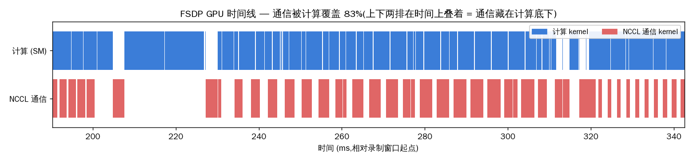

# d8_profiler findings — FSDP 的通信到底被计算盖住了没有

**假设(先说,再看图):** FSDP 每层的 all-gather / reduce-scatter 跑在独立 CUDA 流上,
理想情况下藏在计算 kernel 底下(overlap)。这台机器 **2×5090、无 NVLink、走 PCIe**,
通信慢——所以我赌:**多数通信能被盖住(覆盖率过半),但一定有一段露在外面**,而露出来
的这段,就是 d7 里"双卡总吞吐只有 1.86× 而非 2×"的那笔税。

**判据:** 用 PyTorch profiler 录 3 步真 FSDP,把 GPU kernel 分成"NCCL 通信"和"计算"两类,
算 `覆盖率 = 两类时间区间的交集 / 通信总时`,并把每步 wall-clock 拆成三笔。

---

## 图:GPU 时间线(上排计算、下排通信,叠着 = 盖住)



上排(蓝,计算 SM)几乎连续满载;下排(红,NCCL 通信)一段段跑在**同一时刻**——两排叠着,
就是通信藏在计算底下。中间 ~205–227ms 那道两排都稀疏的缝 = optimizer.step / 步边界的气泡
(既不算也不通信)。

## 数(depth=20,每卡 batch=12,2 卡,3 步)

| 量 | 值 |
|---|---|
| 计算 kernel 忙(3 步合计) | 421.5 ms |
| NCCL 通信 kernel 忙 | 261.8 ms |
| 两者交集(藏住的通信) | 216.9 ms |
| **通信被计算覆盖率** | **83%** |
| 露在外面的通信 | 14.98 ms/步 |

**每步 wall-clock 拆账(159.21 ms/步):**

```
  计算            140.50 ms/步
+ 露在外的通信      14.98 ms/步   ← 通信税(§6)
+ 发射/同步气泡      3.73 ms/步   ← 两条流之间的空隙
= wall-clock     159.21 ms/步
```

## 结论

假设成立。**83% 的通信被盖住,只有 ~15ms/步(≈wall 的 9%)露在外面。** 这 9% 正好对上 d7:
双卡每卡吞吐比单卡慢约 7–9%,所以两卡合起来是 1.86× 而不是 2×。profiler 把"通信税"这个
笼统比值,变成了时间线上两条流之间那道**看得见的缝**。

**怎么让缝变小(而不是玄学调参):**
- **加大 B·T**:每步算得多、给通信更多"藏身"的计算 → 覆盖率↑。把 `DEMO_BATCH` 调小复跑,
  会看到覆盖率掉、露出来的通信变多(§6.3 的通信税 ∝ 1/(B·T))。
- **换有 NVLink 的机器**:通信本身更快,红条更短,更容易被盖住。

## 复现

```bash
.venv/bin/torchrun --nproc_per_node=2 --standalone projects/training_engineering_demos/d8_profiler.py
# 产物在 outputs/demo_traces/:fsdp_trace_ws2_d20.json(可在 ui.perfetto.dev 打开)+ fsdp_overlap_ws2_d20.png
```
